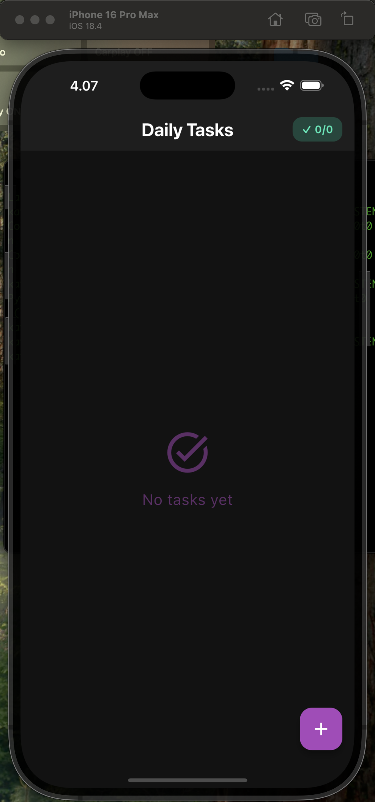

# Flutter Todo App

A modern, feature-rich todo app built with Flutter and GetX state management.

## Features

- ✨ Modern Material Design 3 UI
- 📱 Responsive layout
- 🎯 Task management (Create, Read, Update, Delete)
- ✅ Task completion tracking
- 💾 Persistent storage using GetStorage
- 🔄 State management with GetX
- 🌙 Dark theme
- 📊 Task statistics
- 🔔 Beautiful feedback notifications

## Screenshots

Here's a visual walkthrough of the app's main features:

1. **Empty State**: Clean interface showing "No tasks yet" with a purple accent


2. **Adding First Task**: Creating a new task with title and optional description


3. **Task Created**: Successful task creation notification


4. **Task List**: Displaying the newly created task with completion status


5. **Edit Task Screen**: Interface for modifying existing tasks


6. **Task Completion**: Visual feedback when marking a task as complete


7. **Multiple Tasks**: Managing multiple tasks with completion tracking


8. **Add Task Screen**: Clean and intuitive task creation interface


9. **Task Counter**: Shows total vs completed tasks (2/3) in the header


Each screenshot demonstrates the app's modern dark theme, smooth animations, and user-friendly interface.

## Getting Started

### Prerequisites

- Flutter SDK (2.0.0 or higher)
- Dart SDK (2.12.0 or higher)
- Android Studio / VS Code with Flutter extensions

### Installation

1. Clone the repository:
```bash
git clone https://github.com/[your-username]/flutter-todo-app.git
```

2. Navigate to the project directory:
```bash
cd flutter-todo-app
```

3. Install dependencies:
```bash
flutter pub get
```

4. Run the app:
```bash
flutter run
```

## Project Structure

```
lib/
├── controllers/       # GetX controllers
├── models/           # Data models
├── services/         # Business logic and services
├── theme/           # App theme configuration
├── views/           # UI screens and widgets
└── main.dart        # App entry point
```

## Dependencies

- [get](https://pub.dev/packages/get) - State management, routing, and dependency injection
- [get_storage](https://pub.dev/packages/get_storage) - Key-value storage solution

## Features in Detail

### Task Management
- Create new tasks with title and optional description
- Edit existing tasks
- Delete tasks with swipe gesture
- Mark tasks as complete/incomplete
- Visual feedback for all actions

### UI/UX
- Modern Material Design 3
- Dark theme
- Smooth animations
- Intuitive gestures
- Responsive layout
- Loading indicators
- Success/error notifications

### Data Persistence
- Local storage using GetStorage
- Automatic saving of changes
- Data recovery on app restart

## Contributing

1. Fork the repository
2. Create your feature branch (`git checkout -b feature/amazing-feature`)
3. Commit your changes (`git commit -m 'Add some amazing feature'`)
4. Push to the branch (`git push origin feature/amazing-feature`)
5. Open a Pull Request

## License

This project is licensed under the MIT License - see the [LICENSE](LICENSE) file for details.

## Acknowledgments

- Flutter team for the amazing framework
- GetX team for the powerful state management solution
- The open-source community for inspiration and support
